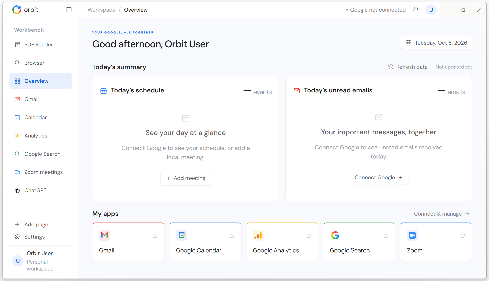
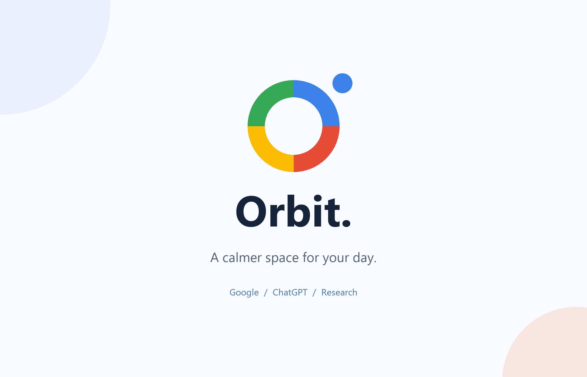

# Orbit Workspace

**A clean, Google-friendly desktop workspace for reading, planning, and working with ChatGPT.**

Designed by **Baiming Zhang** · Windows · English by default · [MIT License](LICENSE)

Orbit brings your everyday web tools and research reading into one calm workspace. Search with Google, keep useful pages open, read papers alongside ChatGPT, and use the home dashboard as a small personal assistant for your day.

**You can download only [Orbit.exe](https://github.com/baiming-zhang/Orbit-Workspace/releases/latest/download/Orbit.exe)** if you just want to use the app. Place it anywhere convenient and double-click it; the source-code folder is not required for normal use.



## Video demonstration

[](https://baiming-zhang.github.io/Orbit-Workspace/)

[▶ Watch online — HD / Standard](https://baiming-zhang.github.io/Orbit-Workspace/) with an embedded player, playback controls, fullscreen and quality selection. No download is needed to watch. The full-width product page keeps a simple layout with three short workflow advantages.

HD: 2560 × 1646 · 30 fps. Standard: 1280 × 822 · 24 fps. Both are approximately 81 seconds, with the recorded window's outer white border and shadow removed, and include a two-second title card, instrumental music, and a five-second closing rights notice. The schedule and email examples shown in the recording are demonstration content. Video files are also available in [Releases](https://github.com/baiming-zhang/Orbit-Workspace/releases/latest).

## Highlights

- **Google-friendly workflow.** Quick access to Google Search, Gmail, Calendar, and Analytics. Optional Gmail and Calendar summaries use official Google APIs, with OAuth authorization completed in your system browser.
- **Multiple ways to work with ChatGPT.** Use a dedicated ChatGPT page, open several conversation tabs, or keep ChatGPT beside a PDF or website. ChatGPT views share the same local sign-in session.
- **Literature-friendly reading.** Open local or online PDFs, switch between papers, resize the reading/chat split, and attach the current PDF to ChatGPT when its upload interface and your account support it.
- **One navigation bar.** Every workspace, including Overview and meeting reminders, shows its address and supports multiple browser tabs. Links open in a new tab within the current workspace. Right-click a link to open it in the current tab, copy its address, or pin it to the sidebar. Built-in pages retain their original tab.
- **A workspace that feels like yours.** Press and hold workspace navigation items to reorder them, customize their names and icons, adjust spacing and text size, and fold away reading controls when you want more room for the page.
- **A fast PDF workflow.** Direct PDF opening and a compact reader aim to make paper reading feel quicker than opening a full browser window. In the author's everyday workflow it feels faster than Edge; no controlled rendering-speed benchmark has been published. Actual performance depends on the PDF, hardware, and cache state.
- **Pages that stay with you.** Frequently used pages can remain open while you switch workspace sections or keep Orbit in the system tray. Persistent sessions retain login state across launches, subject to each website's session expiry and security checks.
- **A homepage that acts like a small personal assistant.** See today's schedule and unread-email summary, add local plans or meeting links, and receive reminders five minutes before events. Google summaries are optional; local planning works independently.
- **Downloads within reach.** The download button sits immediately left of the notification bell. Check progress, open completed files, reveal their location, or open the Downloads folder. Download history stays on this device.
- **Useful extras.** Zoom meeting links, browser tabs, time-zone preferences, English/Chinese interface settings, and an optional local API/MCP bridge.

## Why Orbit alongside Edge?

Orbit brings PDF + ChatGPT reading, a Google-connected daily overview, and a customizable workspace with an optional local API into one desktop application. Edge also supports [PDF reading and split screen](https://www.microsoft.com/edge/features/productivity); Orbit's advantage is the assembled research workflow. No controlled speed benchmark is claimed.

## Small details, more room to read

Orbit includes small touches that make the workspace comfortable for long reading sessions and easy to arrange around your own habits.

- **Put your tools in your own order.** Press and hold an item in the workspace navigation, then drag it up or down. The list scrolls when you reach its edges, and your order is saved. With a navigation item focused, Alt+Up or Alt+Down also moves it.
- **Give each page a familiar name and icon.** Right-click a workspace navigation item to edit its name, website address, or icon. Add shortcuts for your own tools and projects, and remove entries you no longer need.
- **Fold away controls for immersive reading.** Collapse Orbit's sidebar from the top bar. Inside a PDF, use the up-arrow beside the three-dot menu to hide the PDF toolbar; the small down-arrow brings it back. Together, these controls give the document more space and reduce visual clutter while you read.
- **Choose a softer reading background.** Right-click a PDF to choose white, pale blue, pale green, pale yellow, or pale red. The choice colors the empty space on both sides of the document as well as the PDF side panel, and is remembered for future reading sessions.
- **Adjust the reading/chat balance by hand.** Drag the divider between a PDF or webpage and ChatGPT to give either side more space. You can keep the paper wide for close reading, then widen the conversation when working through a question.
- **Set the workspace to your pace.** Settings includes interface text size, comfortable/compact density, and navigation spacing with negative values for a tighter layout. Choose English or Chinese and your preferred time zone. Login preferences let you choose whether supported websites remember credentials and attempt sign-in; saved credentials stay on your device with Windows encryption.

For a focused paper-reading session, arrange your research shortcuts, choose a reading background, fold the sidebar and PDF toolbar, and open ChatGPT only when you want a conversation beside the page.

## A programmable workspace that keeps your desktop free

Orbit's application source is open and editable, so you can adapt the workspace's own commands, integrations, and page behavior to your workflow. Supported API tasks can run while Orbit stays in the background or system tray: a local assistant can read a page's text, retrieve authorized Gmail and Calendar data, or manage local plans without driving the foreground with mouse clicks. This reduces desktop interruptions for workflows that already have an interface.

The current release includes an optional, token-authenticated localhost HTTP API and a Node.js MCP bridge. See [the API implementation](source/app/desktop/local-api.cjs) and [the bridge](source/app/desktop/mcp-bridge.cjs). Developers can extend Orbit's [embedded page host](source/app/desktop/tabbed-browser.cjs) and add narrowly scoped commands to open a page, navigate it, or adapt its presentation, then expose those commands through their own integrations. Opening web addresses and PDF paths through the executable is already supported. Custom website interaction commands require implementation; the shipped API currently provides page listing/text reading, Google summaries and authorized calendar operations, and local-event management.

For example, an assistant can retrieve authorized calendar events through the local API while you continue reading a PDF, instead of repeatedly switching the active window. Developers can build additional ChatGPT webpage workflows around the embedded views, subject to the website's supported interfaces and the user's permission. This release does not ship a general-purpose ChatGPT webpage editing or message-sending API.

Chrome and Edge also support browser automation and are based on the [open-source Chromium project](https://www.chromium.org/Home/). Orbit's advantage is that the entire workspace application and its integration layer are editable in this repository. Background workflows reduce foreground interaction when an API is available; they do not guarantee faster execution or unrestricted access to a website. Website sign-in, authorization, security checks, and service terms still apply.

## Download and run

For editing or redistribution, download the complete **Windows + source ZIP** from [Releases](https://github.com/baiming-zhang/Orbit-Workspace/releases/latest). Its top-level layout is:

```text
Orbit/
  Orbit.exe
  source/
  README.md
  LICENSE
  THIRD-PARTY-NOTICES.txt
  orbit-api-bridge.cjs
```

The executable, source-code folder, README, and license are side by side. The MCP bridge is optional and only needed for local MCP integration.

Double-click `Orbit.exe`. No installation or separate Node.js runtime is needed for the desktop app. Sign in to your own Google and ChatGPT accounts in their pages. English is selected on a fresh launch; existing saved language preferences are respected. The home greeting uses the name returned by your connected Google account, or **Orbit User** when no name is available.

Closing the main window keeps Orbit in the system tray. Right-click its tray icon and choose **Quit** to exit completely.

### Optional Google dashboard connection

Google webpages work independently of the dashboard connection. To enable Gmail/Calendar summaries, create your own Google **Desktop OAuth** client, enable the relevant Gmail and Calendar APIs, and enter the configuration in Orbit's account settings. If your Google Cloud project is in testing mode, add your account as a test user. Calendar write access requires an additional authorization. Account-name greetings use Google's [OpenID Connect profile information](https://developers.google.com/identity/openid-connect/openid-connect); an existing connection may need reauthorization to grant profile access.

### Optional local API and MCP

Enable the local API in Settings when needed. The desktop app runs without Node.js; the separate `orbit-api-bridge.cjs` MCP bridge requires Node.js. Keep the bridge beside the executable and use the configuration copied from Orbit.

## Edit and build

The complete Orbit application source and EXE packaging scripts are available here:

```text
source/app/           HTML, CSS, JavaScript, and Electron application code
source/build.ps1      Windows EXE build entry point
source/build/pack_asar.py  Packs the editable app into an Electron ASAR archive
source/build/Orbit.nsi    Portable EXE launcher source
source/BUILD.md       Build prerequisites and instructions
LICENSE               MIT License
THIRD-PARTY-NOTICES.txt
```

See [source/BUILD.md](source/BUILD.md) to rebuild. The complete release ZIP also includes the Electron runtime template. Large binary files are distributed as release assets rather than committed to Git.

## What's new

### v1.8.14

- Closing the last browser tab creates a fresh Google homepage instead of restoring the closed address.

- Opening a PDF automatically closes the PDF Reader welcome tab. The welcome tab returns only after the last document in that workspace is closed; switching away and back does not recreate it alongside an open PDF.
- Recycle Bin confirmation opens directly below the selected trash button in the download panel, with Confirm delete and Keep. No system message dialog is used. Confirmation is still required before the file is recycled.
- An X button to the right of the trash icon clears a finished download record while retaining the file. Active downloads must finish or be cancelled first.
- Retains v1.8.13's immediate local PDF loading, compact two-line download rows, native file icons, filename actions, and moved/deleted/cancelled states.


### v1.8.13

- Local PDFs start loading without waiting for website cookie restoration, with immediate workspace navigation and an Opening PDF indicator. Initial PDF styling avoids an extra plugin resize and merges duplicate style retries. Web navigation still waits for its saved sign-in session.
- Download entries use a compact two-line layout: click the filename to open it, use the folder icon beside the Recycle Bin button, or right-click the filename to Open, Rename or Move. File icons come from Windows, with Orbit icons for PDFs and a document fallback. Paths and source addresses are omitted from the list.
- Each download row includes a Recycle Bin button and a confirmation dialog. Cancel keeps the file; confirm uses the Windows Recycle Bin. Missing completed files appear gray with a crossed-out filename and Deleted status. Cancelled downloads also appear gray and crossed out while retaining Cancelled status.
- Moving a file through the download panel remembers its new path and shows Moved, retaining Open, Show in folder, Rename and Move actions. Download status refreshes while the panel is open.
- Verified with native PDF document-loading tests, PDF/ChatGPT fixture uploads in four workspaces, real download and Recycle Bin operations, and English/Chinese panel checks. A two-second simulated cookie-restore delay was removed from local PDF startup; this is not a benchmark against Edge or a promise about every PDF's rendering time.


### 1.8.12 · October 9, 2026

- Completed downloads can be renamed directly in the flyout or moved to another folder. Existing files are preserved when a name conflicts.
- Right-click the Downloads button, or open its options menu, to change the default folder or enable download confirmation. Confirmation is off by default; when enabled, the flyout shows file size, source URL and save path before you choose to keep or cancel. Unknown sizes are explicitly indicated.
- Fixed copy buttons in ChatGPT and other secure webpages by permitting clipboard writes in the focused page. Clipboard reading remains denied.
- Switching tabs and opening or closing a ChatGPT split now restores focus to the appropriate page. Resizing the workspace preserves the current focus, including the address bar.

### 1.8.11 · October 9, 2026

- Enabled microphone access for secure webpages, including ChatGPT pages and reading/chat splits. Windows microphone access must also be enabled. Camera and other unrelated permissions remain denied.

### 1.8.10 · October 9, 2026

- Reviewed English and Chinese interface text, including settings, navigation editing, Downloads and PDF attachment status. Only the language label stays bilingual.

- Opening ChatGPT beside a PDF automatically attaches the current file in every workspace, including Overview, Browser and custom navigation pages. PDF attachment follows the file when navigation changes and retries after ChatGPT reloads.
- Attachment status checks the composer for the file before reusing an earlier success, so a removed attachment can be added again. No prompt is sent automatically.

### 1.8.9 · October 9, 2026

- Website addresses entered without a protocol are automatically completed with `https://`, including sidebar navigation creation and editing. Explicit HTTP addresses, searches and local file paths keep their existing behavior.
- The project homepage identifies Orbit as a public beta with frequent updates and maintenance.

### 1.8.8 · October 9, 2026

- Clicking the workspace address bar selects its full address, ready for replacement or pasting.
- Downloads open in a flyout directly beneath the Downloads button. New downloads reveal progress automatically while the webpage stays visible. Close it without progress updates reopening it.
- Website tabs use equal widths and shrink together as more pages open. Long titles remain available in tooltips.
- Fixed navigation editing closing unexpectedly when selecting text beyond the dialog edge.


### 1.8.7 · October 8, 2026

- Unified addresses and browser tab groups across all workspaces, including built-in pages. Original built-in tabs remain available.
- Links open in a new tab in their originating workspace, preserving the source page.
- Added link context-menu actions: open in the current tab, copy the address, and pin to the sidebar. Pinned links are saved as editable navigation items.
- Preserved shared Google / ChatGPT sign-in sessions, PDF reading and ChatGPT split views, and local page-text APIs.
- Updated tab and link-menu controls for English and Chinese.

### 1.8.6 · October 8, 2026

- **Complete English interface text:** translated sign-in and API settings, event details, meeting guidance, fallback labels, and error messages.
- **Native controls:** PDF reading-background menus, saved-account selectors, Google authorization callback pages and tray reminders follow the workspace language. Chromium-owned PDF controls use English.
- **An easy language switch:** the selector keeps the bilingual label **语言 / Language** and bilingual choices in both modes. User-written email, event and document content retains its original language.
- **Validation:** 25 rendered page/dialog states, settings-form language switching, PDF menu language switching and tray text checked successfully.

### 1.8.4 · October 8, 2026

- **Shared workspace navigation:** Browser and PDF addresses, Back, Forward, Refresh, and Open File now sit together in the top workspace bar.
- **More room for content:** the duplicate browser address row is removed; the inner row keeps page/document tabs, +, and ChatGPT controls.
- **Correct active-tab controls:** address and history buttons follow the selected browser or PDF tab; Ctrl+L focuses the shared address field.
- **Layout and language checks:** the shared bar was checked at 1080 px and 1440 px, in English and Chinese, alongside the PDF/ChatGPT split.
- **Clearer automation documentation:** the README explains editable integrations, supported background API tasks, and the website commands developers can add.
- **A guide to the small details:** the README now explains long-press navigation sorting, custom names and icons, folding controls for immersive PDF reading, remembered background colors, draggable reading/chat layouts, and personal settings.

After a new release is published and its download assets are verified, older release packages are removed. Git history and version tags remain available. See [the release procedure](source/PUBLISH.md).

## Project purpose, license and third-party rights

© 2026 Baiming Zhang. Orbit Workspace is an independent, open-source project developed for personal, non-commercial productivity, learning and research. Its application source is distributed under the [MIT License](LICENSE), which governs use and redistribution, permits commercial use, and requires preserving the copyright and license notice. The non-commercial project purpose adds no license restriction. The software is provided without warranty, as described in that license.

Google, ChatGPT, Zoom and other third-party names, logos, trademarks, services and content remain the property of their respective rights holders. References identify the services demonstrated; Orbit is not affiliated with, endorsed by or sponsored by those providers. Third-party services, content and components remain subject to their own terms, policies and licenses; see [THIRD-PARTY-NOTICES.txt](THIRD-PARTY-NOTICES.txt). Respect access controls and the rights of content owners.

For copyright or other rights concerns, [contact the author through an issue](https://github.com/baiming-zhang/Orbit-Workspace/issues/new) with the affected material and ownership information. The author will review the request and remove or replace material where appropriate.
